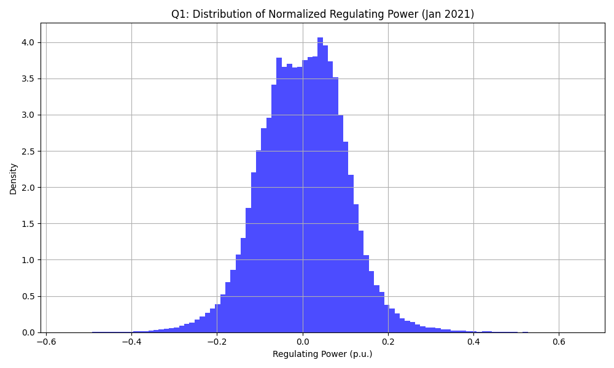
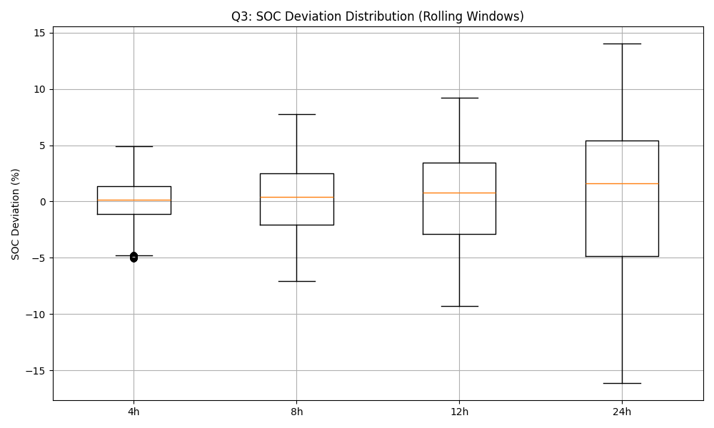
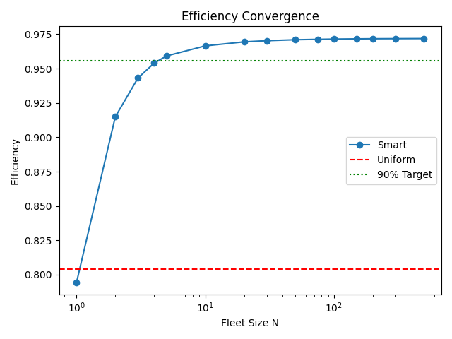
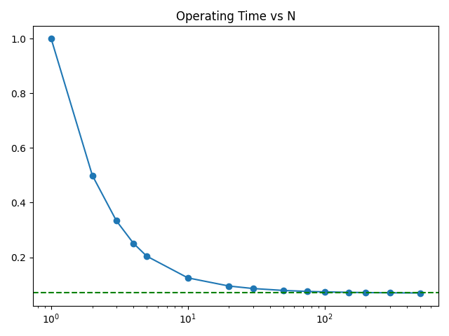
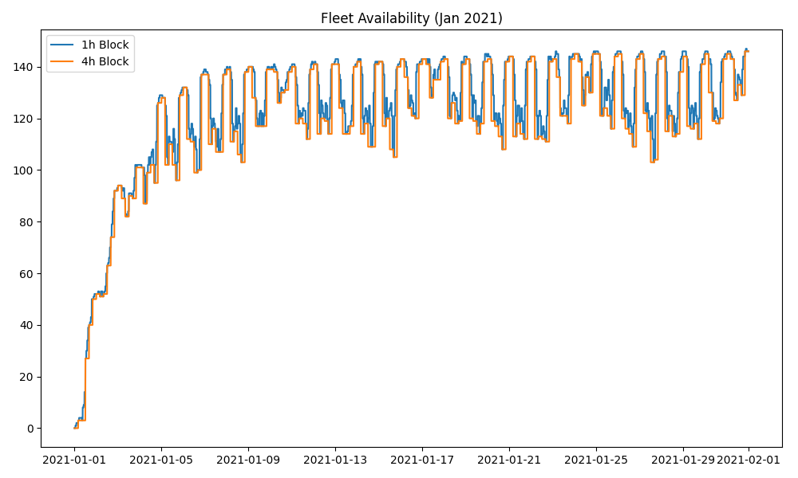
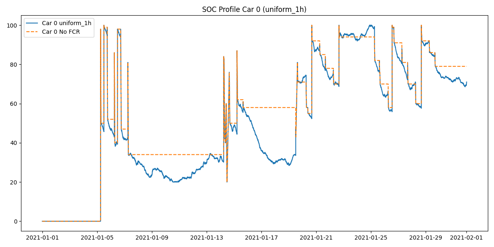

# FCR Participation Report

## Part 1: Grid Frequency Data & Basic Analysis

**Q1:**
- **Data Source:** `data/france_2019_05.csv` (Frequency data).
- **Distribution of Regulating Power:**
  The normalized regulating power $P_{reg}^{p.u.}$ is calculated as $5 \times (f - 50)$ ($K=5$ for 0.2Hz deviation).
  

**Q2:**
- **Observations:**
  The distribution is centered around 0 but exhibits a spread corresponding to frequency deviations. The magnitude rarely reaches full power ($\pm 1$ p.u.), staying mostly within $\pm 0.4$ p.u. The distribution is symmetric, indicating balanced regulation requirements over the month.

**Q3:**
- **Single EV SOC Deviation:**
  The SOC deviation for a single EV providing FCR (without energy management) is shown below for various rolling windows.
  - **Calculation:** $\Delta SOC(t) = \frac{100}{C_{batt}} \int_{t}^{t+T} P_{bid} \cdot y_{red}(\tau) d\tau$.
  - **Parameters:** $C_{batt} = 46.0$ kWh.
  

**Q4:**
- **Reasonability:**
  For short windows (4h), the SOC deviation is relatively small (< 10%). However, for 24h windows, the deviation can grow significantly. Without active energy management (recharging), continuous FCR participation for 24h+ carries a risk of depleting the battery or reaching full charge, confirming the need for a management strategy or limited participation windows.

---

## Part 2: Smart Dispatch Strategy

**Q5:**

- **Uniform Strategy Efficiency:**
  Under the Uniform Strategy, the average fleet efficiency is calculated to be **86.87%**.
  - **Calculation:** $\eta_{avg} = 1 - \frac{\sum Loss}{\sum P_{req}}$, where every car provides $P_{req}/N$.

**Q6:**
- **Smart Strategy:**
  - **Proposal:** A "Smart" strategy concentrates the total power request onto a subset of vehicles, operating them closer to their optimal efficiency point ($P_{opt}$), while keeping others idle.
  - **Limit ($N \to \infty$):** The efficiency approaches $\eta_{max}$ (approx 97%).
  - **Convergence:** The efficiency improves rapidly with fleet size.
  
  - **Minimum Vehicles ($N_0$):** To achieve 90% of the potential gain, a fleet size of approximately **5 vehicles** is sufficient.

**Q7:**
- **OBC Operating Time:**
  - **Derivation:** The fraction of time the OBC is active, $t_{op}$, depends on the probability that a vehicle is needed. For a large fleet using a Smart (Min-Time) strategy, the fleet-wide operating ratio converges to:
    $$t_{op}^{\infty} = \frac{P_{bid}}{P_{max}} \mathbb{E}[|P_{reg}^{p.u.}|]$$
  - **Limit Value:** Calculated as **0.1059 p.u.** (approx 10.6% of time).
  

---

## Part 3: Driving & Charging Behaviour

**Q8:**
- **Inference:** Charging sessions were inferred from `data/driving_sessions.csv`. Trips ending with enough parking time to charge via 7kW AC were labeled as AC (V2G available).
  - **Logic:** $t_{needed} = \frac{(100 - SOC_{stop}) \times 46.0}{100 \times 7.0}$. If $t_{park} \ge t_{needed} \to$ AC.

**Q9:**
- **Coincidence Factor:**
  The number of available AC-connected EVs varies over time.
  

**Q10:**
- **Limitations:**
  Inferring charging from driving has limitations, especially at the year boundaries. If the data is not cyclic, cars driving at the end of the year disappear, and cars at the start appear from nowhere. This leads to inaccurate availability estimates at the start/end of the simulation period.

---

## Part 4: FCR Revenues

**Q11:**
- **Monthly Revenue (Estimated):**
  - **1-hour Blocks:** 70.18 EUR/EV
  - **4-hour Blocks:** 16.81 EUR/EV (Lower due to stricter constraints).
  - **Calculation:** Revenue = $\sum_{t} N_{avail}(t) \cdot P_{bid} \cdot Price_{FCR} \cdot \Delta t$. Price = 18 EUR/MW/h.

**Q12:**
- **Virtual Mileage:**
  - The average virtual mileage per vehicle is approximately **1529 km** per month.
  - **Calculation:** $M_{virt} = \frac{\int |P_{FCR}(t)| dt}{C_{cons}}$.
  - **Parameter:** $C_{cons} = 0.2$ kWh/km.

**Q13:**
- **Residual Value Loss:**
  - The estimated loss in residual value due to this virtual mileage is **0.12 EUR** per month.
  - **Calculation:** $\Delta Value = V(Mileage) - V(Mileage + M_{virt})$.

---

## Part 5: Simulation Framework

**Q14:**
- **Full Simulation:**
  Simulations were run for Uniform and Smart strategies under 1h and 4h block constraints.
  - **SOC Profile (Example - Car 0, Smart 1h):**
    
  - **SOC Profile (Example - Car 0, Uniform 1h):**
    

---

## Part 6: Battery Aging

**Q15:**
- **Battery Model:**
  - **OCV Formula:** $V_{oc} = 360 + 0.85 \times SOC$.
  - **Internal Resistance:** Neglected ($R \approx 0$).
  - **Current Calculation:** $I = P_{term} / V_{oc}$.

**Q16:**
- **Aging Evaluation:**
  Comparing 1-month equivalent aging against a baseline (No FCR, only Driving/Charging):
  - **Baseline Aging Score:** 10.72 (Arbitrary Units)
  - **Uniform Strategy:** +2.39% increase.
  - **Smart Strategy:** +6.56% increase.

  **Conclusion:** The Smart Strategy tends to stress the battery more than the Uniform strategy because it concentrates cycling on fewer vehicles (higher current per active vehicle), and cycling aging is convex with respect to current.
