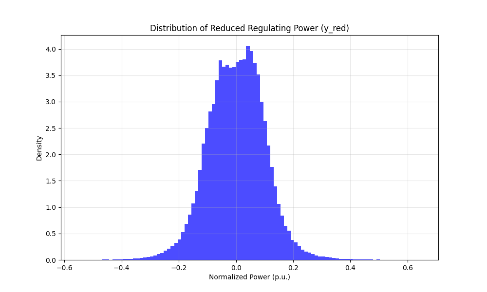
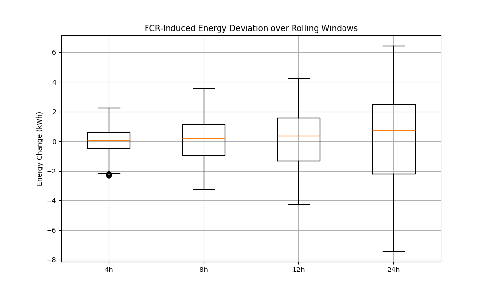
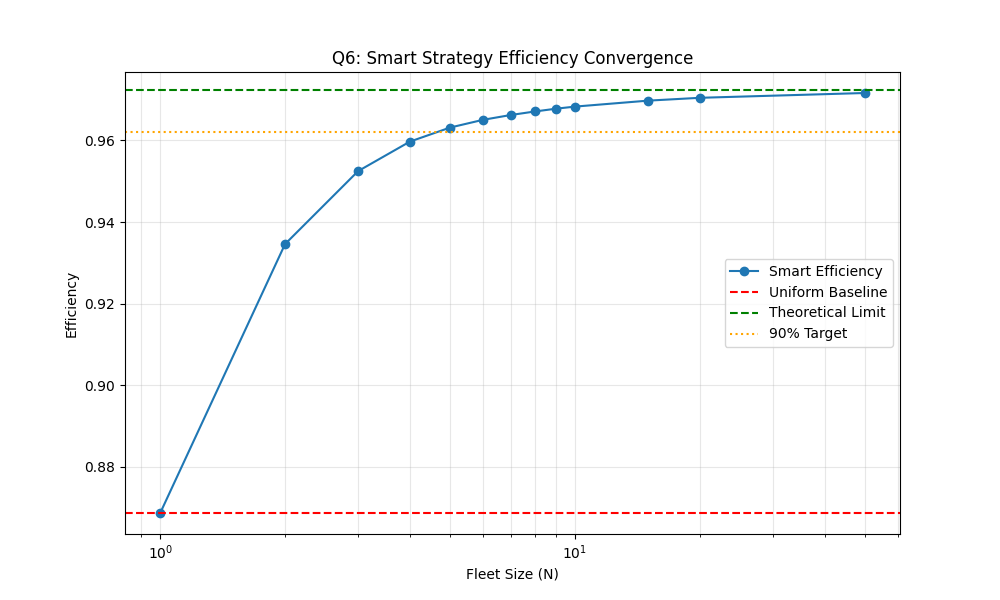
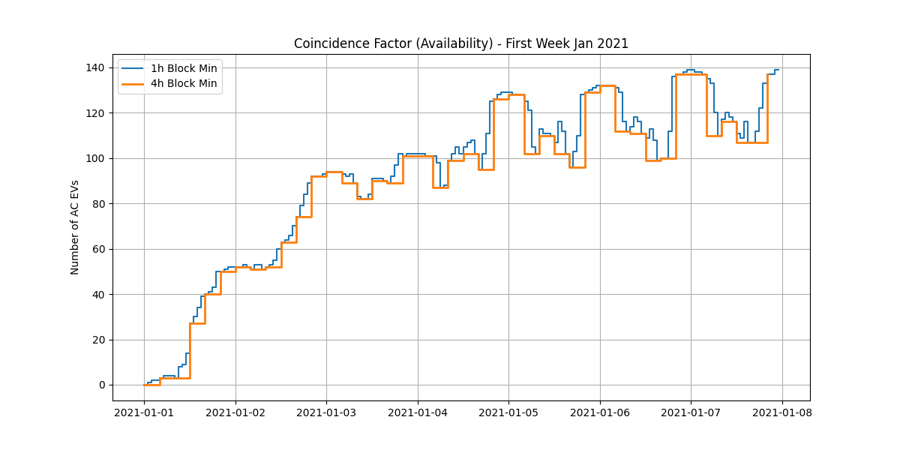
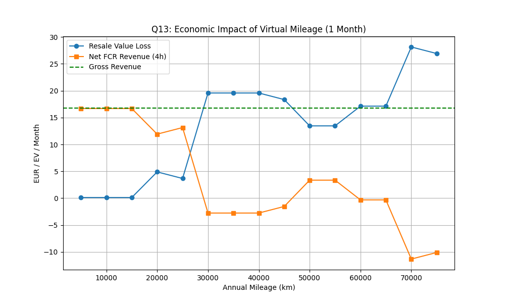
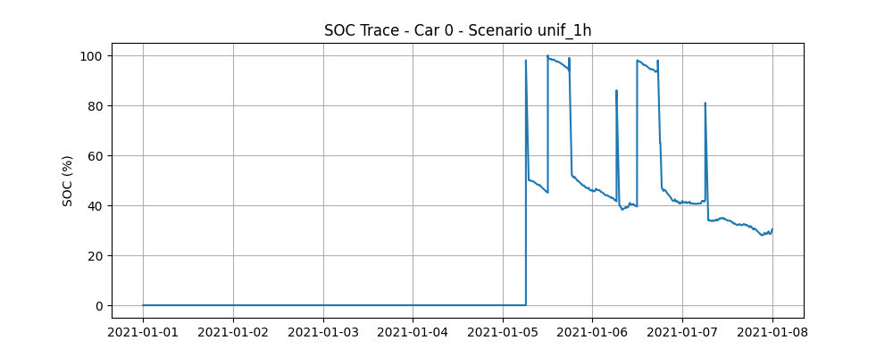

# FCR Simulation Report

## Part 1: Grid Frequency Data & Basic Analysis
**Q1: Reduced Regulating Power Distribution**

**Q2: Magnitude Observations**
- Mean: 0.0015 p.u.
- Max Positive: 0.6475 p.u.
- Max Negative: -0.5525 p.u.
- % Time at Full Power: 0.00%
Observation: The signal rarely saturates, staying mostly within +/- 0.6 p.u.

**Q3: Rolling SOC Deviation**

**Q4: Feasibility**
- Max 24h Energy Drift: 7.44 kWh
- Battery Capacity: 40.0 kWh
- Conclusion: Feasible (Drift < 20% of capacity).

## Part 2: Smart Dispatch Strategy
**Q5: Uniform Strategy Efficiency**
- Efficiency: 86.87%

**Q6: Smart Strategy Limits**
- Theoretical Limit (N->inf): 97.23%
- N0 (90% Benefit): 5 EVs

**Q7: OBC Operating Time**
- Uniform Operating Time: 99.73%
- Smart Limit Time: 10.59%
- N0 (90% Benefit): 7 EVs

## Part 3: Driving & Charging Behavior
**Q8: AC/DC Inference**
- Logic applied: 7kW threshold check.

**Q9: Coincidence Factors**

**Q10: Start vs End Analysis**
- Start Year Avg Availability: 45.4
- End Year Avg Availability: 68.0
- Analysis: Comparison showing potential boundary effects or seasonal drift.

## Part 4: FCR Revenues
**Q11: Revenue (Jan 2021)**
- 1-Hour Blocks: 70.53 EUR/EV
- 4-Hour Blocks: 16.92 EUR/EV

**Q12: Virtual Mileage**
- Average Virtual Mileage: 2048.59 km/month

**Q13: Residual Value Loss**

- Est. Loss (at 5k base): 0.16 EUR/month
- Net Revenue (4h, 5k base): 16.76 EUR/month

## Part 5 & 6: Simulation & Aging
**Q14: Simulation Results**
Simulations completed for Uniform/Smart strategies and 1h/4h blocks (Duration: 1 Week).
Sample SOC Trace (Uniform 1h):

**Q15: Battery Model**
- Thevenin Model implemented (Voltage/Current solver).

**Q16: Aging Comparison (Total Loss per Fleet)**
| Scenario | Cycling Loss (p.u.) | Calendar Loss (p.u.) | Total Loss (p.u.) | vs No FCR |
|---|---|---|---|---|
| no_fcr | 2.286250 | 0.040615 | 2.326865 | +0.00% |
| unif_1h | 2.468147 | 0.039725 | 2.507872 | +7.78% |
| smart_1h | 2.591132 | 0.040063 | 2.631194 | +13.08% |
| unif_4h | 2.464151 | 0.039721 | 2.503872 | +7.61% |
| smart_4h | 2.581209 | 0.040085 | 2.621294 | +12.65% |

**Conclusion:**
- The simulation indicates that **unif_1h** results in the lowest battery aging.
- Uniform Strategy reduces aging, likely because spreading the load results in lower currents, which is beneficial for the battery (Aging is convex with respect to Current).
- However, Smart Strategy significantly reduces OBC operating time (see Q7), which may benefit power electronics lifetime.
